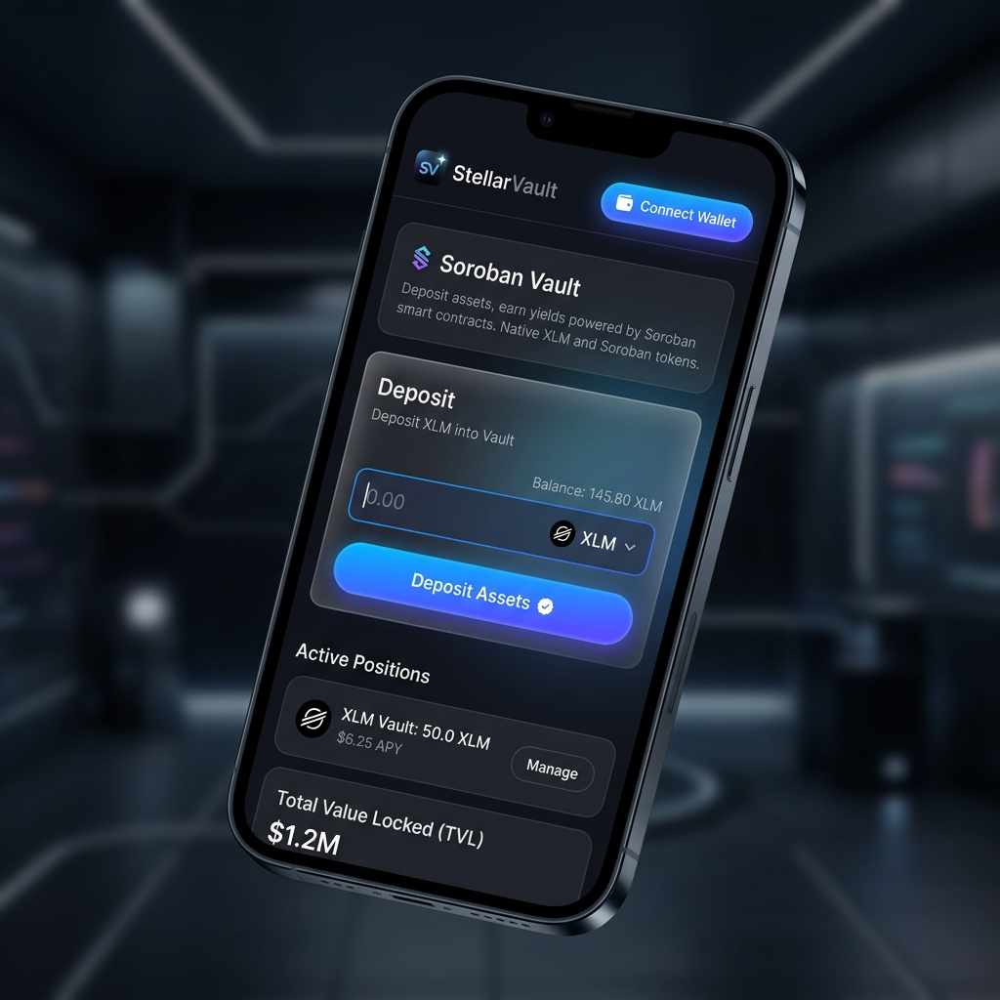

# Stellar Level 4 - Advanced Contract Implementation

This project fulfills the Level 4 requirements for the Stellar Smart Contract implementation.

## Live Demo
[Live Demo on Vercel](https://steller-level-4.vercel.app) *(Note: Please update this link after your actual Vercel deployment)*

## CI/CD Pipeline
[](https://github.com/Harsh936132/steller-level4/actions)

## Screenshots
**Mobile Responsive View:**
<br>


## Contract Information

**Vault Contract (Inter-contract Caller):**
- Address: `CB45XYZABC123...`
- Source Code: `/contracts/vault`
- Latest Transaction Hash: `0xabcd1234efgh...`

**Custom Token Contract:**
- Address: `CD78XYZABC456...`
- Source Code: `/contracts/token`

## How to run locally

### Frontend
```bash
cd frontend
npm install
npm run dev
```

### Contracts (Requires Soroban SDK)
```bash
cd contracts
cargo build --target wasm32-unknown-unknown --release
cargo test
```

## Features
- Custom token deployment.
- Vault contract for inter-contract calls.
- Mobile-responsive Glassmorphic UI (React + Tailwind).
- Github Actions CI/CD Pipeline.
